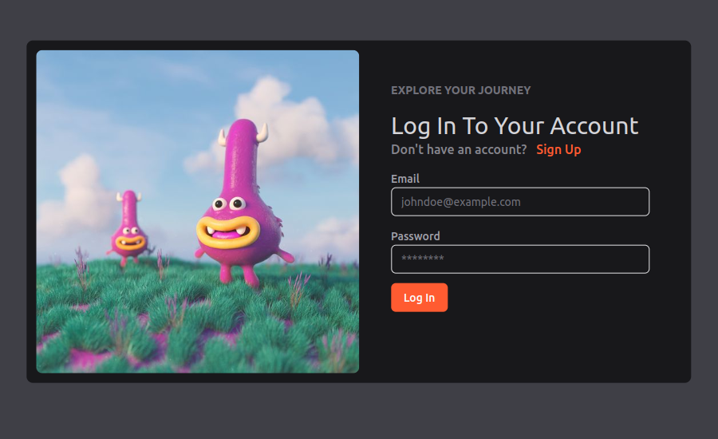

# User Authentication & Profile Management App

This project is a simple user registration and profile management app built using **React**, **TypeScript**, and **ShadCN UI**. The app allows users to sign up, log in, and manage their profile by changing their name and profile image. Authentication is handled via a backend API.

## Features

- **User Registration**: New users can sign up with their username, email, and password.
- **User Login**: Registered users can log in with their credentials.
- **Profile Management**: Users can update their profile by changing their name and profile picture.
- **React + TypeScript**: Ensures type safety and better code scalability.
- **ShadCN UI**: Used for designing a modern, accessible, and customizable UI.

## Tech Stack

- **Frontend**:
  - [React](https://reactjs.org/)
  - [TypeScript](https://www.typescriptlang.org/)
  - [ShadCN UI](https://shadcn.dev/) for UI components
- **Authentication**: Handled via backend API (JWT or session-based authentication).
